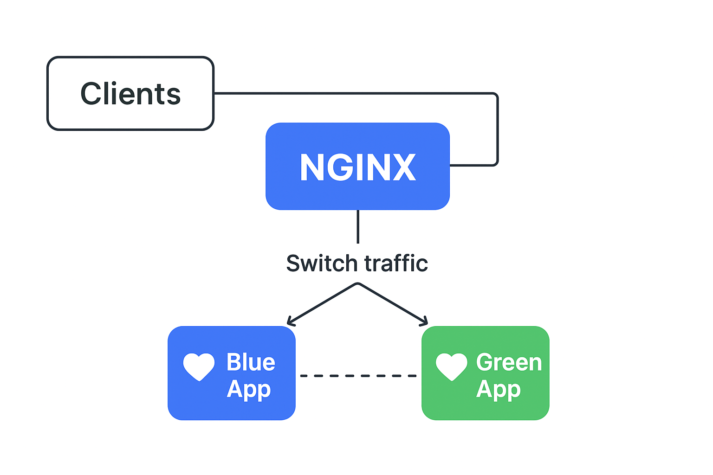

# 🌀 DevOps Intern Stage 2 – Blue/Green Deployment with Nginx Upstreams (Auto-Failover + Manual Toggle)



This project implements a **Blue/Green deployment pattern** using **Docker Compose** and **Nginx upstreams** to achieve **zero-downtime deployments** with **manual environment switching** and **auto-failover** capability.

---

## 🎯 Objective
To simulate a production-style Blue/Green release setup that allows:
- Seamless switching between Blue and Green environments
- No downtime during deployments
- Auto-failover logic within Nginx configuration
- Environment toggle using shell or PowerShell scripts

---

## 🧩 Project Structure

```
blue-green-nginx/
│
├── blue/
│   └── Dockerfile
│   └── server.js
│
├── green/
│   └── Dockerfile
│   └── server.js
│
├── nginx/
│   └── nginx.conf.template
│
├── .env
├── .env.example
├── docker-compose.yml
├── switch.sh
├── rollback.sh
├── switch.ps1
├── rollback.ps1
└── README.md
```

---

## ⚙️ Technologies Used
- **Docker & Docker Compose** – Containerization & multi-service orchestration  
- **Node.js (v18-alpine)** – Lightweight backend for Blue/Green apps  
- **Nginx** – Reverse proxy & load balancer for Blue/Green routing  
- **Shell & PowerShell Scripts** – Environment toggle and rollback automation  

---

## 🐳 Docker Compose Overview

```yaml
services:
  nginx:
    image: nginx:1.25-alpine
    container_name: nginx
    env_file: .env
    ports:
      - "8080:80"
    volumes:
      - ./nginx/nginx.conf.template:/etc/nginx/nginx.conf.template:ro
    command: >
      /bin/sh -c "
      if [ \"$ACTIVE_POOL\" = \"green\" ]; then
        export PRIMARY_HOST=app_green:3000; export BACKUP_HOST=app_blue:3000;
      else
        export PRIMARY_HOST=app_blue:3000; export BACKUP_HOST=app_green:3000;
      fi;
      envsubst '$$PRIMARY_HOST $$BACKUP_HOST' < /etc/nginx/nginx.conf.template > /etc/nginx/nginx.conf &&
      nginx -g 'daemon off;'
      "

  app_blue:
    image: ${BLUE_IMAGE}
    env_file: .env
    environment:
      - RELEASE_ID=${RELEASE_ID_BLUE}
    ports:
      - "8081:3000"

  app_green:
    image: ${GREEN_IMAGE}
    env_file: .env
    environment:
      - RELEASE_ID=${RELEASE_ID_GREEN}
    ports:
      - "8082:3000"
```

---

## ⚡ Environment Variables (.env)

```bash
ACTIVE_POOL=blue
BLUE_IMAGE=blue-app:latest
GREEN_IMAGE=green-app:latest
RELEASE_ID_BLUE=1
RELEASE_ID_GREEN=1
```

---

## 🚀 Build and Run the Containers

```bash
# Build app images
docker build -t blue-app:latest ./blue
docker build -t green-app:latest ./green

# Start containers
docker compose up -d
```

---

## 🧪 Testing the Deployment

### Check which environment is active
```bash
curl http://localhost:8080
```

Expected output:
```
💙 Blue App - Version 1
```

---

## 🔁 Switching Environments

Switch between Blue ↔ Green environments using:

### For Linux/macOS:
```bash
./switch.sh
```

### For Windows PowerShell:
```powershell
.\switch.ps1
```

Then verify:
```bash
curl http://localhost:8080
```
Expected output:
```
💚 Green App - Version 1
```

---

## 🧯 Rollback
If you need to revert to the previous environment:

### Linux/macOS:
```bash
./rollback.sh
```

### PowerShell:
```powershell
.
rollback.ps1
```

---

📁 Git Workflow / Pushing to GitHub

Initialize Git repository (if not already):

git init

Mark directory as safe (Windows only, if needed):

git config --global --add safe.directory C:/Users/banji/projects/blue-green-nginx

Stage all files:

git add .

Commit changes:

git commit -m "Initial commit: Blue/Green Switch project by Yemisi Okunrounmu (DevOps Intern)"

Create a GitHub repository

Go to GitHub
 → New Repository

Name it blue-green-nginx

Do not initialize with README.

Add GitHub remote:

git remote add origin https://github.com/YOUR_GITHUB_USERNAME/blue-green-nginx.git

Push to GitHub (main branch):

git branch -M main
git push -u origin main

Verify files on GitHub

Ensure all scripts, Docker files, docker-compose.yml, .env.example, and README.md are uploaded.


## 📈 Flow Summary

1. **Blue is active** – users see Blue App responses.  
2. **Deploy new release** to Green.  
3. **Switch traffic** using `switch.sh` / `switch.ps1`.  
4. **Validate** Green is working correctly.  
5. **Rollback** if needed using rollback scripts.

---

Final Checklist Before Submission

Files to include in the repo:

README.md → Blue/Green deployment instructions

.env.example → Environment variables template

docker-compose.yml → Compose orchestration

nginx/nginx.conf.template → Nginx template

switch.sh / switch.ps1 → Manual environment switch

rollback.sh / rollback.ps1 → Rollback scripts

DECISION.md → Your reasoning for Part A

PartB_Backend_im_Research.md (or Google Doc link in README) → Research task

Check Git remote:

git remote -v


Ensure it points to your GitHub repo, e.g.:

origin  https://github.com/Yemmmyc/blue-green-nginx.git (fetch)
origin  https://github.com/Yemmmyc/blue-green-nginx.git (push)


Stage all files for commit:

git add .


Commit changes with a clear message:

git commit -m "Stage 2: Blue/Green deployment, DECISION.md, Part B research doc"


Push to GitHub main branch:

git branch -M main
git push -u origin main


Verify on GitHub that all files are uploaded correctly.

Part B submission:

Include a link to your Google Doc for the research task in Slack /stage-two-devops.

Ensure the doc has general view access.

---

## 👩‍💻 Author
**Yemisi Okunrounmu**  
*DevOps Intern*  
📧 Email: [yemmmyc@hotmail.com]  
🌐 GitHub: [[your GitHub link](https://github.com/Yemmmyc/)]

---

## 🏁 Conclusion
This project demonstrates the **Blue/Green deployment strategy** in a simple but realistic DevOps workflow, complete with:
- Dockerized applications  
- Nginx reverse proxy routing  
- Automated environment switching  
- Zero downtime and rollback support  

Perfect foundation for integrating CI/CD automation in future stages.